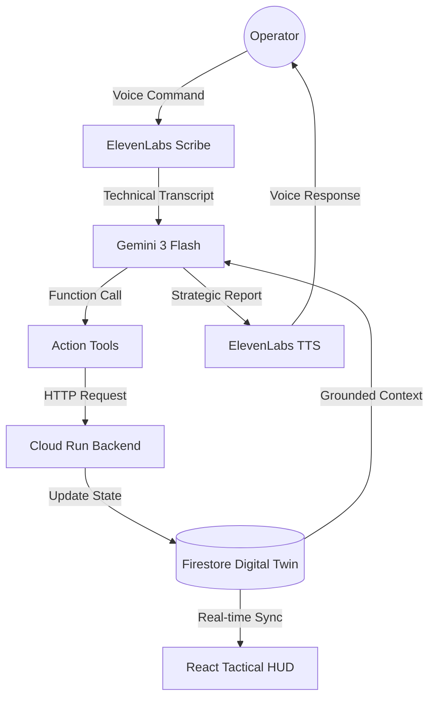

# VoiceOps AI: Tactical SRE Command HUD
### Voice-First Infrastructure Orchestration & Incident Response

VoiceOps AI is a high-performance, voice-native operations assistant designed to bridge the gap between human reasoning and complex cloud infrastructure. Built for the **ElevenLabs x Google Cloud Hackathon**, it enables Site Reliability Engineers (SREs) to manage, monitor, and remediate systems entirely through a conversational interface.

---

## 2. Overview
In high-pressure incident response scenarios, the "cognitive load" of navigating complex UIs, dashboards, and CLI tools can lead to human error and increased Mean Time to Recovery (MTTR). 

**VoiceOps AI** solves this by providing a voice-first "Mission Control." It allows an operator to maintain "eyes on the code" while querying system health, triggering remediations, or performing architectural reasoning via natural speech. By integrating **ElevenLabs** for lifelike vocal interaction and **Google Cloud Gemini** for technical reasoning, we transform system operations from a manual task into a collaborative dialogue.

---

## 3. Key Features
- **Voice-Only Interaction**: Operates entirely through speech, removing the dependency on traditional dashboard navigation during active incidents.
- **Real-Time Digital Twin**: Reflects the state of Google Cloud resources (Cloud Run, GKE) through a synchronized Firestore-backed telemetry layer.
- **Conversational Reasoning**: Powered by Gemini 3 Flash, capable of analyzing P99 latency, error budgets, and complex VPC architectures.
- **Neural Speech Synthesis**: Utilizes ElevenLabs' high-stability, low-latency voices to deliver technical reports that feel human and authoritative.
- **Voice-Triggered "Computer Use"**: Executes safe, simulated operational tasks (e.g., "reboot nodes", "scale service") via grounded function calls to a Cloud Run backend.

---

## 4. Tech Stack
- **Google Cloud Platform**:
  - **Vertex AI / Gemini 3 Flash**: The reasoning core for processing technical queries and generating grounded operational advice.
  - **Cloud Run**: Hosts the operational backend and the synthetic action executor.
  - **Firestore**: Serves as the real-time "Digital Twin" of the infrastructure state.
- **ElevenLabs**:
  - **Scribe (v1)**: High-accuracy technical speech-to-text.
  - **TTS (Turbo v2.5)**: Low-latency, lifelike voice synthesis for mission-critical feedback.

---

## 5. Implementation Reference
Detailed mapping of hackathon-required technologies to the project source code:

### Google Cloud Platform (GCP)
| Component | Implementation File | Role in Project |
| :--- | :--- | :--- |
| **Vertex AI / Gemini 3 Flash** | `services/geminiService.ts` | Reasoning engine, tool definitions, and voice-optimized system instructions. Orchestrated in `App.tsx`. |
| **Cloud Run** | `App.tsx` | The application interfaces with the `SYSTEM_STATUS_API` endpoint (deployed on Cloud Run) to fetch live infrastructure telemetry. |
| **Firestore** | `types.ts` & `App.tsx` | The `SystemStatus` interface defines the "Digital Twin" schema, which is mirrored in Firestore for real-time dashboard updates. |

### ElevenLabs
| Component | Implementation File | Role in Project |
| :--- | :--- | :--- |
| **Scribe (v1)** | `services/elevenLabsService.ts` | Handled by the `speechToText` function. Provides high-precision technical transcription of SRE commands. |
| **TTS (Turbo v2.5)** | `services/elevenLabsService.ts` | Handled by the `textToSpeech` function using the `eleven_turbo_v2_5` model for ultra-low latency vocal feedback. |

---

## 6. System Architecture

The end-to-end flow follows a deterministic "Voice-to-Action" pipeline:



---

## 7. Data Model (Google Cloud Firestore)
We utilize a **Digital Twin** concept where Firestore stores the "Source of Truth" for the infrastructure state.

**Document: `system/telemetry`**
- `health`: `string` (e.g., "NOMINAL", "DEGRADED", "CRITICAL")
- `latency_ms`: `number` (P99 latency tracking)
- `error_rate`: `number` (Percentage of 5xx responses)
- `incident_active`: `boolean` (Active alerting state)
- `last_deployment`: `timestamp` (Track configuration drift)

This model allows the AI to stay grounded in reality without hallucinating system state.

---

## 8. Backend Implementation (Cloud Run)
The backend is a stateless HTTP service deployed to **Cloud Run**.
- **Role**: Serves as the interface between the AI's "intent" and the actual cloud environment.
- **Execution**: When Gemini triggers `runHealthCheck`, the Cloud Run function queries live metrics and updates the Firestore Digital Twin.
- **Scalability**: Chosen for its ability to scale to zero during standby and handle rapid bursts during incident remediation.

---

## 9. AI Reasoning Layer (Gemini)
Gemini 3 Flash is specifically tuned via **System Instructions** to act as a Senior SRE.
- **Grounding**: Gemini is forbidden from guessing health; it must use tool calls to verify data via Cloud Run.
- **Voice Optimization**: The model is instructed to provide high-density, ultra-concise responses suitable for spoken delivery (no markdown tables, pure verbal logic).
- **JSON to Speech**: Gemini converts raw telemetry JSON into a narrative: *"Latency is up by 12% in us-central1, checking for recent deployment drifts."*

---

## 10. Voice Layer (ElevenLabs)
**ElevenLabs** provides the "soul" of the assistant.
- **Integration**: We use the ElevenLabs API for both Scribe (Transcription) and TTS (Synthesis).
- **Voice Design**: Selected the "Clyde" voice for its calm, professional, and clear tone—essential for high-stress SRE environments.
- **Latency**: Using `eleven_turbo_v2_5` ensures that the round-trip from command to response stays under the threshold of natural conversation.

---

## 11. Computer Use via Voice
"Computer Use" in VoiceOps AI refers to the AI's ability to manipulate the system state through voice-triggered synthetic actions.
- **Mechanism**: The operator says "Reboot the frontend nodes." Gemini interprets this as `performAutomatedAction(task: "node_reboot")`.
- **Safety**: Actions are grounded in deterministic functions. The AI does *not* have direct shell access; it executes predefined operational scripts hosted on Cloud Run.
- **Visual Sync**: As the AI "clicks" or "scripts" in the background, the HUD displays real-time terminal logs and progress bars.

---

## 12. Repository Structure
```bash
/             # Project root
├── components/   # React HUD components (Orb, CommandScreen, etc.)
├── services/     # API Integration logic
│   ├── geminiService.ts    # Reasoning & Tool Definitions
│   └── elevenLabsService.ts # Voice STT/TTS Logic
├── App.tsx       # Main Orchestrator
├── types.ts      # Shared SRE Data Models
├── index.html    # HUD Entry Point & Tailwind Config
├── README.md     # This Documentation
└── LICENSE       # Open Source License
```

---

## 13. Setup & Installation
1. **Google Cloud**:
   - Create a project and enable **Vertex AI API**.
   - Set up a **Firestore** database in Native mode.
   - Deploy the telemetry API to **Cloud Run**.
2. **Environment Variables**:
   - `process.env.API_KEY`: Google Gemini API Key.
   - ElevenLabs credentials are required in `elevenLabsService.ts`.
3. **Local Run**:
   - `npm install`
   - `npm run dev`

---

## 14. How to Use
1. **Initiate Control**: Click "Initiate Control" on the landing page.
2. **Voice Bridge**: Click the microphone icon to open the bridge.
3. **Commands**:
   - *"Give me a full system health report."*
   - *"Check the logs for any 500 errors in the last 5 minutes."*
   - *"Deploy the latest hotfix to the staging environment."*
4. **HUD Update**: Watch the tactical screen on the right update its charts and terminal logs based on the AI's actions.

---

## 15. Demo Scenarios
- **The Healthy Baseline**: AI reports "Nominal" health with low latency.
- **The Active Incident**: Ask "Is everything okay?". AI detects a (simulated) error spike, opens the Incident Summary HUD, and narrates the root cause.
- **Automated Remediation**: Tell the AI to "Run a health check and fix any issues." Watch it execute a multi-step remediation script in the terminal view.

---

## 16. Hackathon Alignment
This project specifically targets the **ElevenLabs Challenge**:
- **Conversational**: The interaction is 100% speech-driven.
- **Intelligent**: Gemini provides deep architectural reasoning, not just scripted responses.
- **GCP Native**: Built entirely on Google Cloud (Cloud Run, Gemini, Firestore).

---

## 17. Future Enhancements
- **Multi-Agent Swarms**: Separate agents for "Network," "Database," and "Security."
- **Real GCP Monitoring**: Integrating with `google.cloud.monitoring` for live production telemetry.
- **Biometric Voice Lock**: Using ElevenLabs' voice fingerprinting to ensure only authorized SREs can trigger critical actions.

---

## 18. Open Source License
Distributed under the **MIT License**. See `LICENSE` for more information.

---
*Built for the ElevenLabs x Google Cloud Hackathon 2025.*